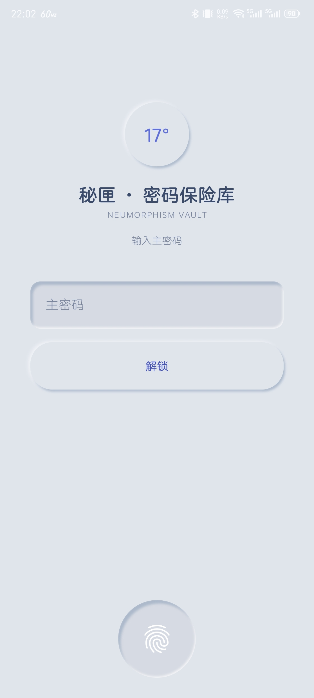
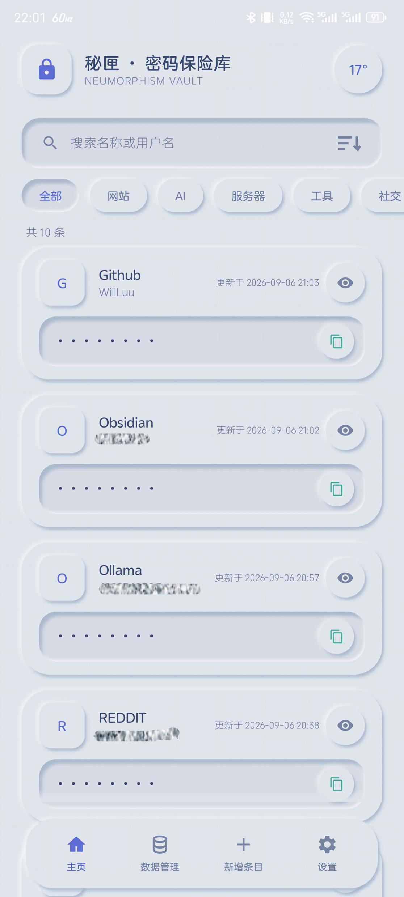
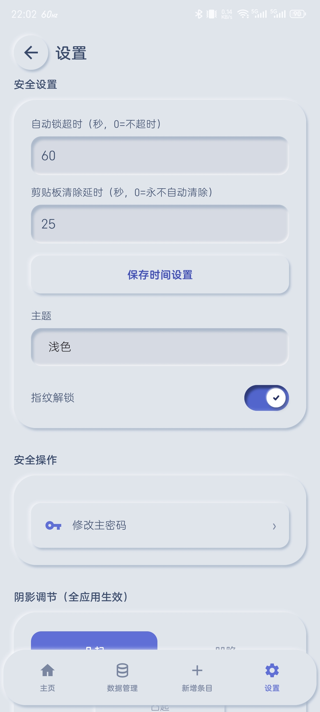
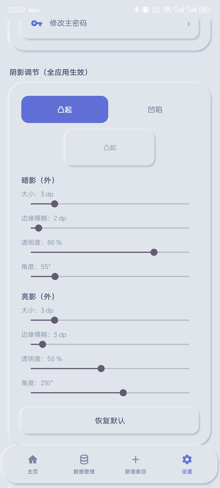

# 离线密码本（Offline Vault）

纯离线密码管理器——**Android 原生 + Windows 桌面（Compose Desktop）双端**，所有数据本地加密存储，无网络、无账号、无云同步。新拟态（Neumorphism）视觉，三主题可切换，阴影参数可按口味个性化调节。两端通过同一份 `.vault` 加密备份互导迁移。

> **状态**：v1.1.0（2026-09-10）—— Android v1.0.x + Windows 桌面版（M1–M6 + 跨端互导验证）；加密核心经多轮内部自审（含逐文件安全审查）核实，契约测试全绿。

## 界面截图

<table>
<tr>
<td></td>
<td></td>
<td></td>
<td></td>
</tr>
<tr>
<td align="center">解锁页</td>
<td align="center">密码列表</td>
<td align="center">设置</td>
<td align="center">阴影个性化调参</td>
</tr>
</table>

## 特性

- **主密码解锁**：Argon2id 派生 KEK → verifier 校验 → AES-256-GCM 解包 DEK；支持生物识别两段式解锁（Android Keystore）
- **条目管理**：增删改查、软删除、列表掩码；搜索 / 5 种排序（名称升降序、分类升降序、最近更新）/ 分类过滤；列表全量加载无条数上限
- **自定义词条**：平台/帐号/密码固定词条之外，可增删改自定义词条（邮箱/网站/备注/任意标签），全局模板同步
- **批量录入**：粘贴自由文本笔记 → 智能解析为多条（中英文标签、`: ： =` 分隔、空行/重复标签切分）→ 预览可编辑可勾选 → 一键写入，分类按名称自动匹配或新建
- **分类管理**：种子分类、拖拽重排、按名称/条数/创建时间自动排序、「其他」不可删保护
- **密码生成器**：SecureRandom，可调长度（4–64）与字符集
- **数据管理页**：导出 / 导入 / 批量录入 / 分类管理 + 密码统计（总数、各分类条数、未分类）
- **加密备份**：导出 / 导入 `.vault`（主密码同源 KEK 或独立导出密码），SAF 用户自选保存位置；导入按 (名称, 账号, 分类) 合并、按更新时间取新
- **三主题**：浅色 / 深色 / 莫兰迪（+跟随系统）；新拟态阴影 16 参数可调（带实时预览与恢复默认），适配不同口味
- **安全策略**：切后台立即锁 / 前台空闲超时锁 / 复制后自动清除剪贴板（延时可配，切后台兜底冲刷）/ 全 App 禁止截屏（FLAG_SECURE）
- **细节体验**：方向感知左右滑动切页动画、可更换头像（EXIF 方向修正 + 采样解码）、全弹窗统一自绘新拟态风格（NeuDialog）
- **完全离线**：`AndroidManifest` 无网络权限，数据不离开设备
- **Windows 桌面版**：Compose Desktop（Material3），与 Android 共用同一份加密核心；条目管理/检索/生成器/备份互导全功能；三主题（浅色/深色/莫兰迪，色板与手机端逐 token 对齐）；输入框凹陷 + 键帽式立体按钮；数据目录 ACL 收紧（仅当前用户+SYSTEM）；CLI 工具（`init/stats/add/export/import`）

## 安全设计

- 存储加密：AES-256-GCM（每次独立随机 12B nonce，无复用；GCM 认证失败显式抛错，绝不静默返回错误明文）
- 密钥派生：Argon2id（m=32MB / t=2 / p=1，随机 16B 盐；高于 OWASP 移动端下限；旧参数库在下次密码解锁时自动静默迁移）
- 信封加密：随机 DEK 加密条目，KEK 仅由主密码派生、用毕即清零；主密码不以明文/可逆哈希存储，仅存加密 verifier
- 主密码 / 独立导出密码最小长度均为 8 位；内存 DEK 锁定时显式清零
- 解锁失败限流：连续 5 次失败进入冷却，每次 +30s 递增、封顶 5 分钟；冷却期内不执行 KDF（防攻击者稳定付满算力试错），UI 提示剩余等待时间
- 生物识别：Android Keystore 两段式（per-op 认证 + setInvalidatedByBiometricEnrollment），指纹登记变更自动失效并自愈；主密码永远可用作兜底
- SQL 全参数化（ORDER BY 来自枚举、LIMIT/OFFSET 为受控整数）；应用无网络权限、`allowBackup=false`
- 数据/加密契约详见 [`api-contract.md`](./api-contract.md)

## 技术栈

- Android 原生 Kotlin（minSdk 26 / targetSdk 34），Material3 主题 + 自绘新拟态组件（NeuSurface / NeuSwitch / NeuDialog）
- SQLite（无 ORM，SQL 单源 `backend/src/vault/SqlBuilders.kt`）
- 纯 JVM 加密/存储层（`backend/src/vault/*`）与 UI 层分离，契约测试与 Android DAO 共用同一 DDL/SQL，两端零漂移
- KDF 采用 Bouncy Castle 纯 Java Argon2id（无 native 依赖，全 ABI 通用，与 argon2-jvm 测试向量逐字节对齐）
- 桌面端：Compose Multiplatform Desktop 1.6.11（Kotlin 1.9.24 + Compose 编译器 1.5.14），存储走 sqlite-jdbc，与 Android 共用 `vault-core` 同一份 DDL/SQL/加密

## 目录结构

```
vault-core/    纯 JVM 加密、存储、合并逻辑（零 android.* 依赖，桌面与 Android 共用单一事实源）
vault-android/ Android 胶水（SQLite DAO / Keystore 生物识别 / 解锁管理 / 备份读写）
vault-desktop/ 桌面端适配（sqlite-jdbc 存储 + 解锁链路 + 备份 + CLI）
frontend/      Android 应用（:app-android；ui/ 页面、common/ 新拟态组件）
app-desktop/   桌面应用（Compose Desktop UI）
backend/       历史脚本与文档（契约测试已迁至 vault-core）
api-contract.md   本地数据访问 + 加密规范契约
schema.sql        DB schema
```

## 构建

需 JDK 17；Android 端另需 Android SDK（`frontend/local.properties` 指向 `sdk.dir`）。

```bash
# Android 应用（仓库根，多模块）
./gradlew :app-android:assembleDebug
# 产物 frontend/build/outputs/apk/debug/app-android-debug.apk
adb install -r frontend/build/outputs/apk/debug/app-android-debug.apk
```

桌面版（Windows，仓库根）：

```bash
./gradlew :app-desktop:run                        # 开发运行
./gradlew :app-desktop:createDistributable        # 自包含目录（含精简 JRE，免安装）
# 产物 app-desktop/build/compose/binaries/main/app/offline-vault/offline-vault.exe
./gradlew :app-desktop:packageDistributionForCurrentOS   # MSI/EXE 安装包（需本机 WiX 3.x）
```

桌面 CLI（跨端搬运/运维）：

```bash
./gradlew :vault-desktop:runCli -q --args="stats <主密码>"
./gradlew :vault-desktop:runCli -q --args="export <主密码> <输出.vault> same|<独立导出密码>"
./gradlew :vault-desktop:runCli -q --args="import <主密码> <输入.vault> <文件密码>"
```

契约测试（纯 JVM，不依赖 Android SDK）：

```bash
./gradlew :vault-core:contractTests               # 期望输出 ALL CONTRACT CHECKS OK
./gradlew :vault-desktop:desktopChecks            # 桌面端存储/解锁自检
# 或在 backend/ 下：TOOLCHAIN_DIR=/path/to/toolchain bash build_and_test.sh
```

> Android 首次安装即进入「设置主密码」流程（两段输入，最小 8 位）。

## 开发者

- 品牌 / 标志：**17°**
- 开发者：**Will Joel (L17) / 拾柒**
- 许可：**MIT**

## 已知边界（诚实清单）

- **v2 全加密**：条目 `name/username` 与分类名均已加密入库（折进 `secret_blob` / `name_blob`），明文列退化为空占位；搜索/排序在解锁后于内存进行。用 SQLite 客户端打开 `vault.db` 只见密文与结构性整数（id/时间戳/category_id）。v1 旧库在下次解锁时静默迁移至 v2（事务内、幂等）
- 进程被系统回收时无法保证剪贴板清除（系统级限制）；存活场景已用切后台兜底冲刷覆盖
- 解锁失败限流计数为内存态，进程被杀后归零（离线单机权衡；抗爆破同时依赖 Argon2id 派生成本与 8 位主密码下限）
- DB 升级迁移：Android `DB_VERSION=2` / 桌面 `PRAGMA user_version=2`，v1→v2 结构迁移在开库时执行、数据迁移在解锁后执行（均需版本化迁移段，脚手架已就位）
- 仓库默认构建为 debug 签名，供学习与侧载；上架商店需替换 release 签名

**桌面端（Windows）特有边界**：

- **无防截屏等价物**：Android 的 FLAG_SECURE 在 Windows 无系统级能力，桌面端无法阻止截图/录屏/远程桌面捕获。缓解：密码默认掩码、点眼才显形、复制延时清除——但**无法根除**，请勿在不受信环境展示明文
- **剪贴板历史**：若系统开启了剪贴板历史（Win+V），复制过的密码可能被系统持久化留存，程序只能清除当前剪贴板、无法清除历史——建议在该功能设置中关闭或排除
- **威胁模型变化**：Windows 无应用沙箱，任何以同一用户身份运行的进程都可读取 `%APPDATA%\OfflineVault\vault.db`。数据目录已收紧 ACL（仅当前用户+SYSTEM），但同用户恶意软件风险自担（与 KeePass 等桌面密码管理器同级）
- **凭证通道**：桌面版 MVP 仅主密码解锁（无生物识别/设备凭证快速解锁；DPAPI/Windows Hello 集成为后续候选）；JVM 对密钥的内存清零是尽力而为（GC 拷贝与页面文件不受控）

## 鸣谢

- 加密算法参考 argon2-jvm / BouncyCastle；UI 语言参考 Soft UI / 新拟态设计实践
- 本项目为个人学习与实践作品，请勿用于生产级敏感凭证管理
